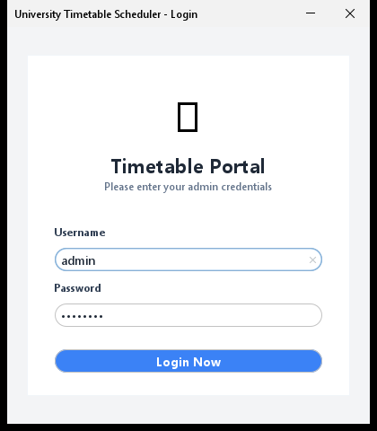
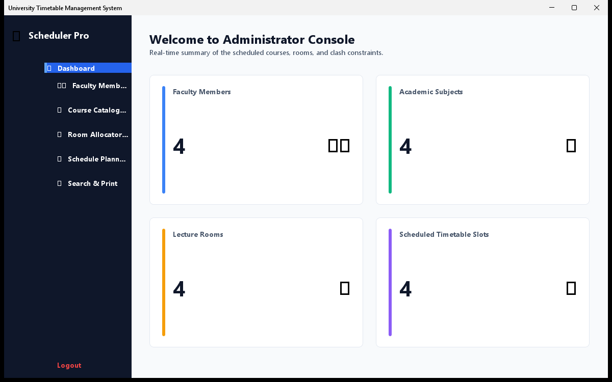
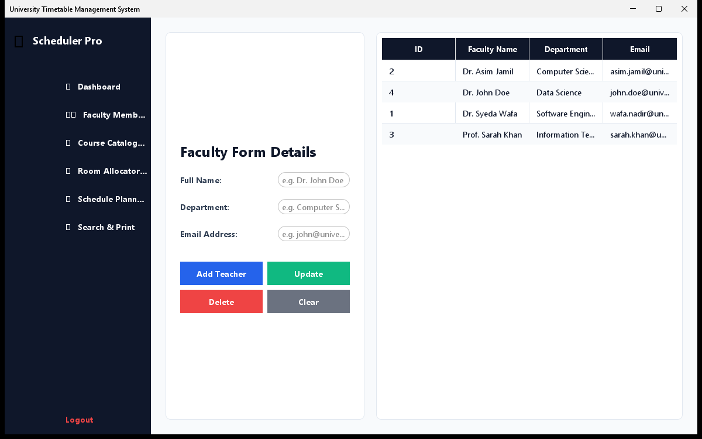
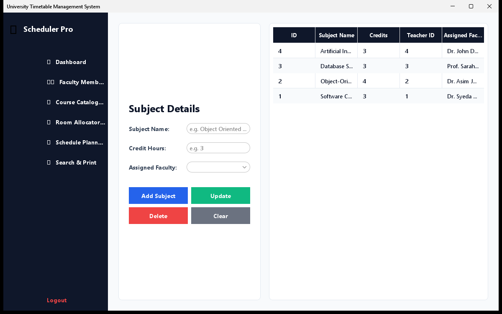
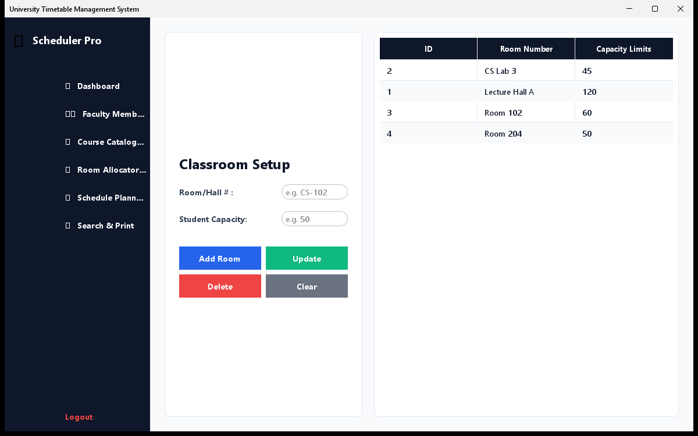
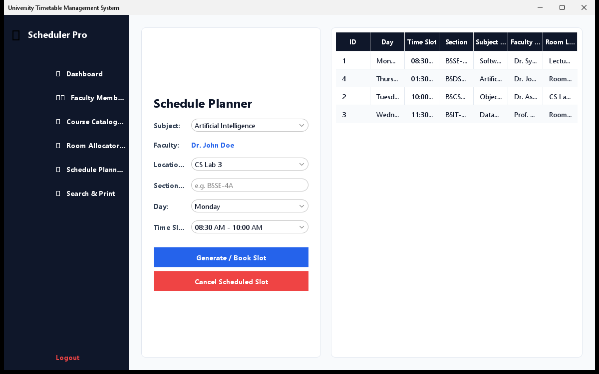
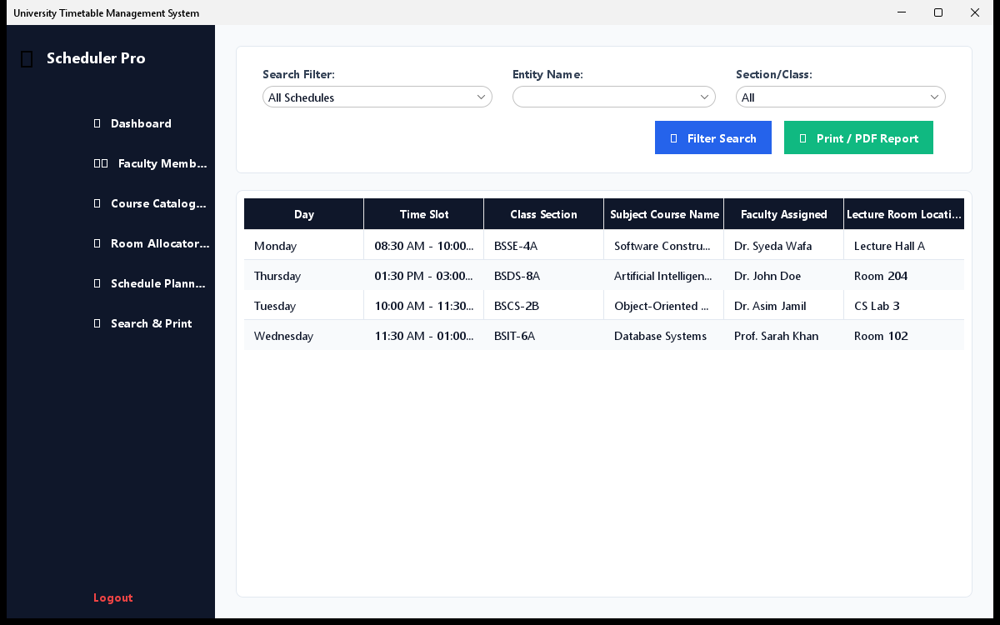

# University Timetable Management System

A Java Swing-based desktop application designed to automate, schedule, and manage university course timetables. It integrates a local SQLite database for storing schedules and provides conflict-checking algorithms to prevent double-booking of rooms, teachers, or class sections.

---

## 👥 Student Information
- **Student Name:** Syeda Wafa Nadir
- **Roll Number:** l1f23bsse0425
- **Course:** Software Construction & Development Semester Project

---

## 📝 Project Description
In universities, scheduling is often a complex task managed manually using spreadsheets, leading to class clashes, room unavailability, and scheduling errors.
The **University Timetable Management System** is designed to streamline and automate scheduling processes. It ensures classes, teachers, and rooms are scheduled optimally without conflicts, improving accuracy and reducing confusion for students and faculty.

---

## 🌟 Key Features
1. **Admin Authentication Login:** Secure access control for system administrators.
2. **Dashboard Overview:** Live counter metrics of total faculty members, subjects, rooms, and active scheduled sessions.
3. **Faculty / Teacher Management:** Full CRUD operations (Create, Read, Update, Delete) for teacher records.
4. **Subject Management:** Manage academic courses and allocate subjects to faculty.
5. **Room Management:** Record room numbers and student seating capacity.
6. **Timetable Generator & Planner:** Assign subjects to days and time slots, allocate rooms, and bind sections.
7. **Conflict Checker System:** Prevents clashes:
   - *Teacher Conflict:* Warns if a teacher is already booked for another course at the same time slot.
   - *Room Conflict:* Prevents booking an occupied room.
   - *Section Conflict:* Prevents scheduling two classes for the same student section simultaneously.
8. **Dynamic Timetable Viewer:** Search and filter schedules dynamically by Teacher, Room, or Class Section.
9. **Print / Export Report:** Print the filtered timetable or save it as a PDF.

---

## 🛠️ Tech Stack & Dependencies
- **Frontend:** Java Swing GUI (native look & feel)
- **Backend/Logic:** Core Java, Object-Oriented Programming (OOP)
- **Database:** SQLite (Embedded DB)
- **Driver Connectivity:** JDBC (SQLite driver included automatically via launcher script)

---

## 🚀 Installation & Setup Instructions
1. **Prerequisites:**
   - Make sure you have the Java Development Kit (JDK) installed on your system.
   - Ensure the JDK `bin/` folder is added to your system environment variables `PATH`.

2. **How to Run:**
   - Go to the project root directory.
   - Double-click the **`run.bat`** script file.
   - The launcher will automatically download the SQLite JDBC driver jar, compile the Java source files, and start the application.

3. **Default Admin Login Credentials:**
   - **Username:** `admin`
   - **Password:** `admin123`

---

## 📷 Screenshots

Here are the visual representations of the modernized FlatLaf UI:

| Admin Login Portal | Dashboard Console |
| :---: | :---: |
|  |  |

| Faculty Management | Course Catalog |
| :---: | :---: |
|  |  |

| Room Allocator | Timetable Planner |
| :---: | :---: |
|  |  |

| View & Print Schedule |
| :---: |
|  |

---

## 📈 Future Enhancements
- **Multi-user Roles:** Separate portal login views for teachers and students.
- **Excel/CSV Import:** Bulk upload of room list and faculty details from spreadsheets.
- **Auto-Scheduler (Genetic Algorithm):** Fully automated schedule generator using artificial intelligence heuristic search algorithms.
